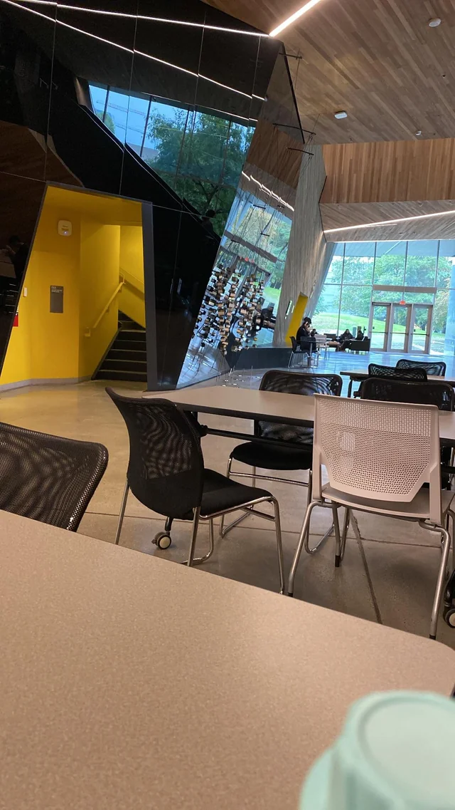

#

🏫

Study Spots

!!! quote "/u/chilylugia"

    *This might be my last year at UBC, so my partner encouraged me to study at every single building on campus! (since I’ve only pretty much studied at the biology building for the past few years LOOOL)*

    *I hope that this will also encourage y’all to check out different buildings for study spots as well! (Pls don’t come at me for revealing your “secret study spot” 😅 just hoping this will be helpful to some people ☺️)*

Thank you to [/u/chilylugia](https://www.reddit.com/user/chilylugia) for putting this together!

---

There’re often many spots in a building, I just picked wherever was free, so there’s plenty for y’all to explore too :)

## 1) Pharmaceutical Sciences Building

A bit farther out, with quite a few study spots on the first floor. Gets busy around noon in between classes, but mostly quiet-Ish. However, there aren’t a lot of spots with plugs.

<figure markdown>
  { align=left width="200" }
</figure>

## 2) AMS NEST

There’s a BUNCH of spots here, but gets taken / busy pretty much all the time. It opens pretty late as well, so you can do some pretty late night grinds. I personally study on the third and second floors sometimes.

## 3) Woodward Library

Very quiet as you’d expect, with plenty of seats with some plugs. The wifi is pretty good here, though it was a bit busy when I came here around afternoon. Pretty nice space overall.

## 4) Student Life Building

I came during a holiday Monday, so hella empty, but usually pretty busy whenever I walk past it. Not too many plugs around here though, but a few food and drinks options.

## 5) School of Population and Public Health

Very few spots in the basement, but pretty quiet with not too many people around.

## 6) IKB

The classic study spot, very overcrowded and a lot of talking. Good luck finding a spot here, but has plenty of outlets, though I am personally not a big fan of studying here tbh.

## 7) MacMillian Building

Plenty of spots at Agora Cafe, with no too many plugs here. But the seating is very comfy, and a very nice vibe here.

## 8) Life Sciences Institute

Very spacious with a lot of study spots, but a bit out of the way like the pharmacy building. Also a lot of seats with plugs, highly recommend!

## 9) Hennings

Not a lot of study spots, the one I found is in the hallway. It’s honestly pretty nice here, my only complaint is that the washrooms are pretty out of the way lol.

## 10) ICICS

Pretty of study space, well lit, and plenty of plugs! Gets busy sometimes, but I do like this spot a lot too.

## 11) Forestry

One of the prettiest building on campus to study at! Which means that the seats are hella hard to come by, but if you do manage to snatch a seat, there’re plugs in every table and even a Tim’s nearby.

## 12) Leon and Theo Koerner University Center

Very quiet down here with a kitchen! Not too many study spots, weak-ish wifi, and out of the way (by Rose Garden), but it’s got plenty of natural light and plugs for each table.

## 13) Brock Hall

Overall pretty quiet here, with not that many people! I say one of the nicest places on campus, with a lot of seats with plugs, just not too much places to sit and study though. Definitely somewhere worthwhile to explore around for your own spot!

## 14) LASR

Definitely a spot that I won’t recommend LOL. The seats are comfy-ish, and there’s many charging plugs, but there’s no desks anywhere. So this is great for a quick study sesh, I studied here for 3 hours and my back hurts :,)

## 15) Iona

Super nice and cozy is here! It’s very out of the way, but definitely worth the trip! It’s pretty crowded after 2pm, so I would come earlier. There’s a kitchen area with a microwave too, so great for a long study sesh with many plugs by the wall seats!

## 16) Allard Hall

Pretty out of the way, but that’s why there’s plenty of seats around. Not all of them have plugs or a desk that’s a decent height, but it’s chill here with some decent wifi.

## 17) Asian Library

Out of the way, but pretty empty most of the time. There’re a good amount of plugs and a lot of natural light. They have a kitchen too, quite a nice comfy spot! The chairs are VERY comfy.

## 18) Buchanan

Extremely busy as you might expect, especially hard to find spots in between classes, but good amount of plugs and desk space if you do. This building is huge, so it was fun to explore around and find different spots!

## 19) Law Library

Out of the way, but man this place is REALLY nice. All of the desks have plugs, lamp, and overall great lighting. It’s very quiet here, and chairs are comfy as well. Highly recommend this place for studying if you don’t mind going out of your way, though it does get busy around afternoon.

## 20) David Lam Library

This is the library in Sauder, and there’s a LOT of spots here! Many of the desks have plugs and private covers, so perfect for napping too. Again, comfy seats and good lighting, recommend this place as well. Though it gets busy too around noon.

## 21) Math Annex

Honestly a very nice study spot with barely any people and chargers at both tables… yes, there’s only two tables here on the second floor, so you’ll have to get lucky 🤣 I actually quite enjoyed studying here though!

## 22) Swing Space

It’s a very nice building with some great natural lighting, though there’s barely any wall plugs. So you want to do a short study sesh, or you don’t care about charging a device, I highly recommend studying here!

## 23) Koerner Library

Very quiet library to study at, with a lot of seats, and decent amount of plugs as well! It’s a very solid location to study, with great napping spots in the basement. The fire alarm got pulled when I was studying there though 🥲

## 24) Aquatic Centre

Yes, apparently this is considered a study spot, and no, this is the worst one by far… 🤣 it’s very hot and humid, with the swimming pool smell and no wall plugs… I also felt super awkward since there’re people swimming around LMAO

## 25) Orchard

There’re surprisingly a lot of study spots in orchard! Definitely a lot of people studying here, I’m guessing residents, so the wifi is actually pretty good, and there’s plenty of lighting and wall plugs! The couches are also comfy to nap on :)

## 26) X̱wi7x̱wa Library

Very quiet space with pretty much nobody around! Not much seating and plugs, so great place to go for a silent alone studying sesh. Since it’s a small library, I was too scared to eat snacks and stuff LOL, so I dunno if you’re allowed 🤣

## 27) Hugh Dempster

I wasn’t too much of a fan for this place… the wifi is VERY weak for me, and the seating is too high, so my posture was shit. Despite the nice lighting and wall plugs, there aren’t too many seats either.

## 28) CEME

Two tables here with somewhat accessible wall plugs. The seats aren’t the most comfy, but the lighting is very nice and actually a nice spot to study at. There are couches for midday naps too!

## 29) War Memorial Museum

It was the cold snap when I went, so it was very cold in here, especially since the tables are right next to a door… there aren’t wall plugs nearby either, so I wasn’t a huge fan. But it’s right next to the bus loop, so convenient if you want to study for a bit before a bus comes!

## 30) Engineering Design Centre

Very quiet here with not many people. The seats on the second floor all have plugs, and the wifi is very strong here too! I honestly quite like this spot, and I highly recommend it :)

---