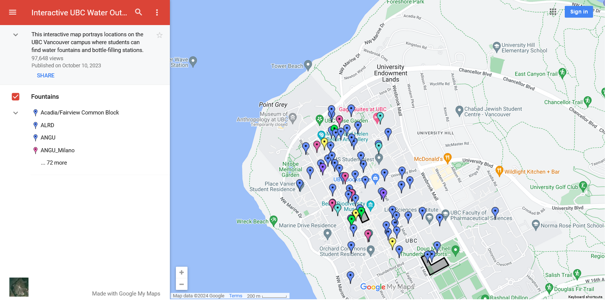

#

🚰

Water Fountains

This page is a work in progress. To contribute or make a suggestion, [see the instructions here](../index.md#contributing).

---

Please see this [interactive map of water outlets](https://www.google.com/maps/d/u/0/viewer?ll=49.267665139292845%2C-123.24913480426028&spn=0.014028%2C0.038066&msa=0&iwloc=0004d8b88fe8029eba263&mid=1fmvuTk4654NGRwoIon6yadBx_LY&z=15), created in 2013 and last published in 2023.

<figure markdown="span">
  { width="700" }
  <figcaption>Screenshot of the map</figcaption>
</figure>