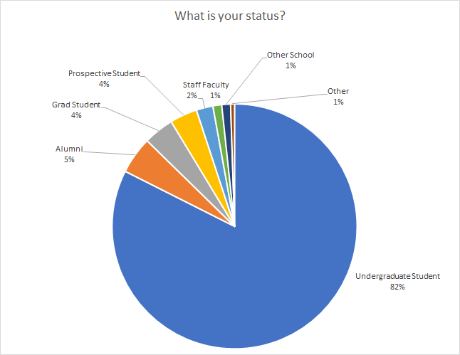
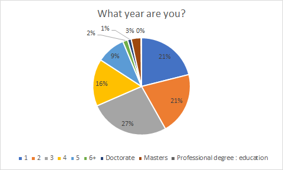

# 

📊

r/UBC Census 2018

## Raw Results

The census this year saw 777 responses.  Out of these responses, 3 were discarded for being obvious trolls.  Obviously, being an online survey, the results could be distorted, but nothing indicates that in the data collected.  You can view the complete results [here](https://imgur.com/a/GbaqPT0).

&#x200B;

## General demographics

### Status of users

This subreddit is, unsurprisingly, overwhelmingly undergraduates    

|%|r/ubc|
|-|-|
|Undergrad|82%|
|Alumni|5%|
|Grad Student|4%|
|Prospective student|4%|
|Staff and faulty|3%|
|Other|2%|

<figure markdown>
  { width="600" }
</figure>

### Faculty of users

To the shock of absolutely no one, science and computer science dominate.  However, Arts still has a pretty good showing.  

|Faculty %|r/ubc|
|-|-|
|Arts|23.0%|
|Applied Science|20.8%|
|Commerce|6.72%|
|Kinesiology|1.64%|
|Medicine|1.35%|
|Science|40.4%|
|Computer Science|16.0%|
|Psychology|3.29%|
&#x200B;

<figure markdown>
  { width="600" }
</figure>

### Year and gender split

The gender split skews male 65/35.  

<figure markdown>
  { width="600" }
</figure>

<figure markdown>
  { width="600" }
</figure>

Something interesting, out of the 15 ELEC students who responded, *0 were female*.  Must be a lonely program.

The year split is very balanced. 

<figure markdown>
  { width="600" }
</figure>

|Year %|r/ubc|
|-|-|
|1st year|21%|
|2nd year|21%|
|3rd Year|27%|
|4th Year|16%|
|5+ year|11%|
|Does not use years|4%|

##International and Domestic students

|Domestic/international|r/ubc|
|-|-|
|Domestic (BC)|21%|
|Domestic (ROC)|21%|
|3rd Year|27%|
|4th Year|16%|
|5+ year|11%|
|Does not use years|4%|

&#x200B;

If you want to explore some (probably spurious) correlations, send me a message.

&#x200B;

&#x200B;

## How does this data comPAIR with the general UBC student body?

UBC PAIR contains demographical information from which it would be interesting to compare certain subreddit demographics with.  Here are some :

&#x200B;

||r/ubc|UBCV|
|:-|:-|:-|
|Gender ratio (overall M/F)|65/32|44/56|
|% of students\* international|17%|27.3%|
|% of students that are undergraduate students|95%|66.1%|

&#x200B;

\*Question wasn't optional, despite the fact that the question only applied to students.  As such, question is only a rough estimate.

&#x200B;

Breakdown of select faculties and departments

|Faculty %|r/ubc|UBCV|
|:-|:-|:-|
|Arts|23.0%|28.5%|
|Applied Science|20.8%|12.3%|
|Commerce|6.72%|10.9%|
|Kinesiology|1.64%|2.27%|
|Medicine|1.35%|7.78%|
|Science|40.4%|17.6%|
|Computer Science|16.0%|2.70%|
|Psychology|3.29%|4.61%|

&#x200B;

## How does this data compare with a comparable subreddit?

Mainly, r/uwaterloo, which also did a demographics survey.  Uwaterloo, as a very STEM heavy school, is perhaps  not the best comparison, but r/uoft hasn't done a demographics survey, so we're stuck with the goose school.  Some main comparisons:

||r/ubc|r/uwaterloo|
|:-|:-|:-|
|% of students in CS|16.0%|27%|
|% of students in Engineering|20.8%|34.1%|
|% of students in Arts|23.0%|8.7%|
|Gender ratio (M/F)|65/32|73/25|
|% of students domestic?|83%|87.9% (Question asked for citizenship, did not include PR)|

While Uwaterloo organizes it's faculties in a different manner than UBC, Arts and engineering are still a comparable faculties.  However, comparing faculties of Science is not possible.   As such, CS has been used, as it is a large department in both subreddits.  (Credit to u/fugbox)

---

Thank you to [/u/Justausername1234](https://reddit.com/u/Justausername1234) for putting this together!