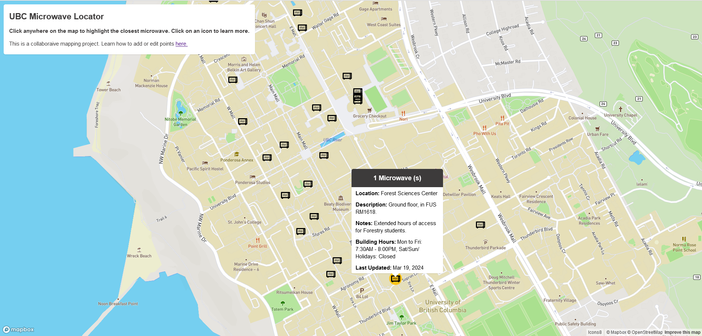

#

🍿

Microwaves

In 2024, user [u/woodentoucan](https://reddit.com/u/woodentoucan) created this microwave location map and open source data set!

**Source Code:** [:simple-github: summer-h-s/summer-h-s-web](https://github.com/summer-h-s/summer-h-s-web/tree/main/Lab2)

- [:material-navigation-variant-outline: __Open the Map__](https://summer-h-s.github.io/summer-h-s-web/Lab2/ubcv_microwaves_map.html){ .md-button .md-button--stretch-center }

- [:material-puzzle-edit-outline: __Add / Update data__](https://docs.google.com/spreadsheets/d/1meLUxBldPY7nR5bxVDAH_YshUEVnrjwjLYQZtJVxCR8/edit#gid=1254679531){ .md-button .md-button--stretch-center }

<figure markdown="span">
  { width="700" }
  <figcaption>Screenshot of the map</figcaption>
</figure>

!!! quote "/u/woodentoucan"

    Hi! I'm a commuter student who knows how difficut it can be to find a convenient microwave on campus, especially on days where time is short. I made this map to help you locate the nearest public microwave. Plus, anyone can contribute to the dataset so the information should stay accurate and up-to-date.
    
### How to add microwaves to the map?

1. Open the spreadsheet using the link above.
2. If you want to add a new microwave to the map or edit an existing point, simply make a comment with your changes in 'Sheet1', so spreadsheet moderators can accept the update.

### What can you add?

- To add a point you must provide map coordinates, which can be found here: [latlong.net](https://www.latlong.net/) or by clicking on a location using a site like Google Maps.
- Please try to add other information like:
    - Number of microwaves at the location
    - Building name of the location
    - Description of how to get to the microwave
    - Any relevant notes
    - Building hours
    - The date of your update (so future viewers can guage the information accuracy)								
- Microwaves must be PUBLICLY ACCESSIBLE. No staff room/ residence floor/ private club room locations please!

---

## Other Resources

In 2017, the [SEEDS Lunch Hubs student research report](https://sustain.ubc.ca/sites/sustain.ubc.ca/files/seedslibrary/LunchHubs_Reportv5%20SEEDS_0.pdf) contained information on microwaves and "campus food preparation and eating areas". See the link for more information about the resource.
