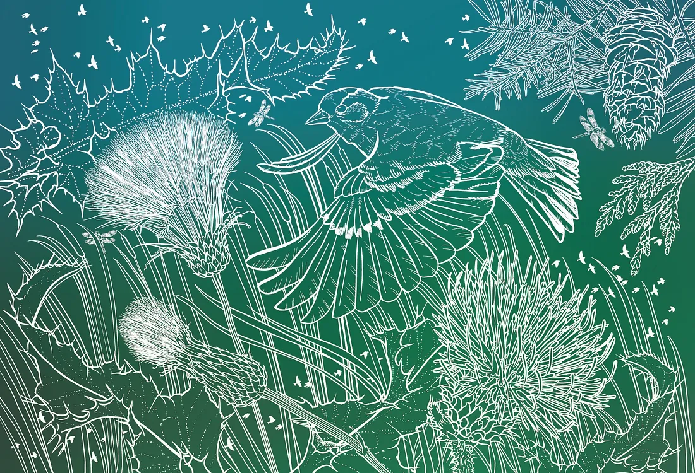
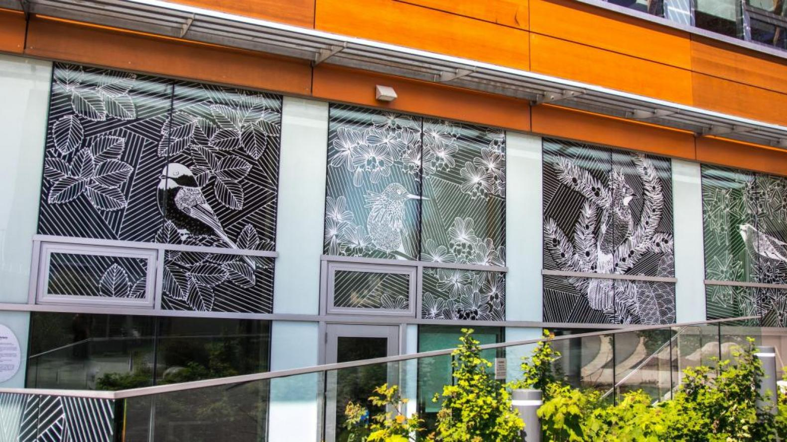
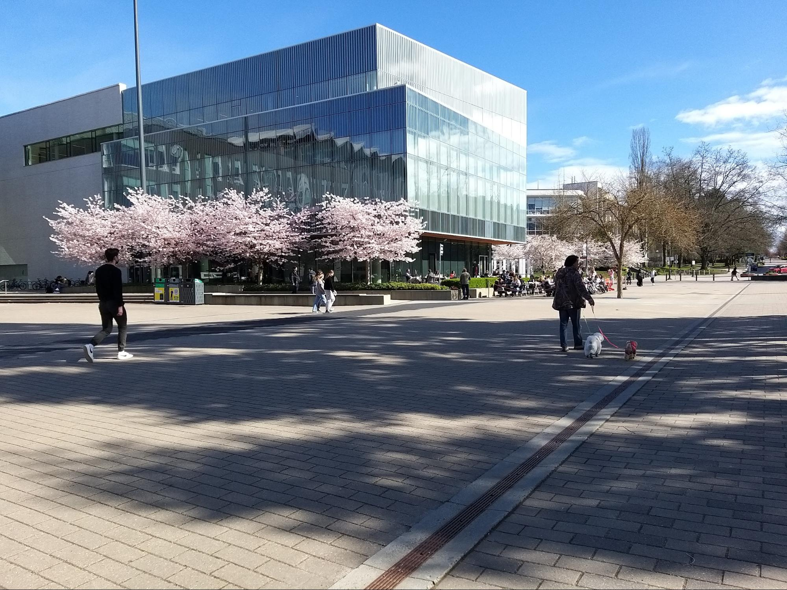
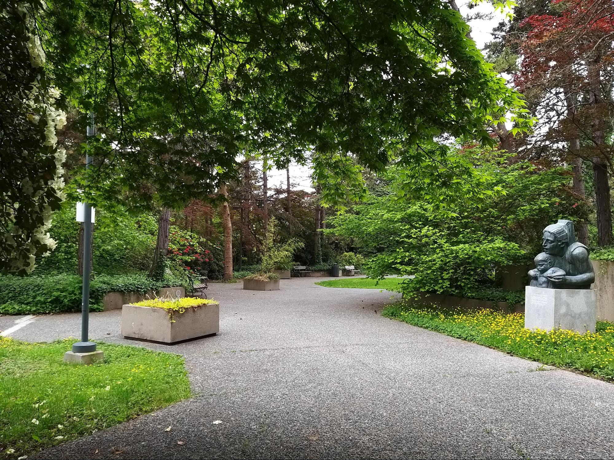

# 👟 Places to visit & Things to do
---
<!-- toc -->
---

> *The ages old, traditional questions of what to do/where to go/must-see sights/hidden gems/bucket list items haunts the UBC community every year, asked by every person new to UBC, from incoming freshman/transfer/exchange students to visitors, and even old seasoned students who just never took/had the time to look around. Here's your answer to those questions.*
> 
> *I created this a couple of years ago and have sporadically updated it since, so it's by no means a comprehensive list, but hopefully serves some people well. If anyone has additions, I'll try to keep this updated and this will also be one of the resources in the r/UBC wiki. I also wanted to note that this is not my work alone. Along with my own suggestions, I've compiled ideas from friends and other people that I've seen from other r/UBC threads, so thank you everyone.*
> *Happy exploring!*
> 
>    \- /u/AniriC

### Gardens:
* Rose Garden (go in the summer June-July for roses)
* Nitobe Memorial ([tea ceremonies](https://botanicalgarden.ubc.ca/visit/nitobe-memorial-garden/the-tea-house-and-roji/) are held within Nitobe at an authentic tea house and roji)
* Botanical Gardens (+TreeWalk)
* IKB Learning Commons

### Beaches/Parks:
* Wreck Beach (clothing optional beach; please respect the place and people - no staring or photographing)
* Pacific Spirit Park
* Oasis Beach
* Spanish Banks
* Tower Beach (Biol 140 students may be intimately familiar with this one)

### Museums/Art Galleries/Theatres:
Note that you may have free access to these as a UBC student!

* **Beaty Biodiversity**: 
    - world's largest blue whale skeleton & two million captivating specimens
* **Museum of Anthropology**: 
    - 50,000 remarkable cultural artifacts and items
* **Pacific Museum of Earth**: 
    - Room of gemstones and interactive exhibits related to weather / the planet
    - While you're here, you can also checkout the Elasmosaurus skeleton in ESB
* **Belkin Art Gallery**: contemporary art gallery
* **AHVA Gallery**: contemporary exhibition space for students & faculty
* **Residential School History and Dialogue Centre**:
    - exhibit and interactive display to learn more about the legacy of residential schools in Canada
* **Chan Performing Arts Centre**

### Food/Drinks:
(I know this is not comprehensive at all, just a quick-fire list of what's available - I'm also not guaranteeing food quality here - see previous threads about food/tier lists)

* The Pit
* Sprouts/Seedlings
* Agora Cafe
* Blue Chip
* Bean Around the World
* Great Dane Coffee
* Mercante
* Rain or Shine
* Jamjar
* Village Basement (My Home Cuisine, Donair Town, Only U Cafe, etc)
* Kokoro Mazesoba
* Uncle Fatih's
* DownLow Chicken
* Kinton Ramen
* Tacomio
* The Point
* The Delly
* Loafe
* Booster Juice
* Flavour Lab

> **Looking for more information about food on campus?**
> 
>  Check out the [🍴 Food Spots](./food.md) page!

### Libraries:
* Asian Centre
* Woodward 
* Allard
* Education (has a seed library and [Tower Garden](https://education.library.ubc.ca/blog/visit-the-tower-garden-winner-of-the-ubc-library-innovation-grant/), an aeroponic growing system)
* X̱wi7x̱wa Indigenous library
* Koerner (visit the dungeon)
* David Lam

## Various art/installations around campus:

Note: may or may not still be around - some installations are transient

#### [Reconciliation Pole](https://students.ubc.ca/ubclife/what-reconciliation-pole) 

#### [Rain activated art ](https://www.youtube.com/watch?v=1FTKS-dXC2o)

#### [Bird friendly window art](https://sustain.ubc.ca/stories/bird-friendly-art-saves-feathered-lives)
- can be found on CIRS building and UBC Botanical garden

  

  

#### [LGBTQ rainbow Pride wall ](https://news.ubc.ca/2018/10/15/ubc-officially-unveils-pride-installation-at-heart-of-campus-today/)

#### [Pressure washer art](https://imgur.com/7j7UCSf) 
- I don't have a name for this and could never find it online - I found it in first year, but it's now covered up by shrubbery

  

#### [Millennial Time Machine](https://ahva.ubc.ca/events/event/rodney-grahams-millennial-time-machine/) 
- in the 19th century carriage by Buchanan)

#### [Vegetal Encounters](https://www.hollyschmidt.ca/vegetal-encounters)
- word art on windows of AHVA gallery

#### [Native Hosts](https://belkin.ubc.ca/collections/#hock-e-aye-vi-edgar-heap-of-birds-native-hosts) 
- aluminum signs with 'British Columbia' spelled backwards with Today Your Host Is

#### The Shadow 
- differently coloured bricks, honestly you're never seeing it unless you're in a helicopter above campus

## Miscellaneous
(Don't quite fall under the other categories but worth a look or visit)

- Cherry blossoms during the spring (can be found by the nest, along main mall, various other spots across campus)

  

- Autumn at UBC
- Fairy lights on main mall

  

  
* Top floor of OC (or Buchanan Tower or Ponderosa) (if you can get somebody to give you access the view is lovely)
* labyrinth a little northwest of Great Dane Coffee
- Waterfall and garden area between the Health Sciences Parkade and the hospital

  

* Buchanan swing
* UBC Farm
* Old Barn Community Centre about 2 mins from the forestry building
* Nest rooftop garden
* Hill behind MOA
* Vanier cliffs (apparently gone, but some still might be there?)
* Bioenergy Research and Demonstration Facility 
* The greenhouse can light the sky up funky colours at night - sometimes mistaken as the aurora 
* Student Wellness Centre (the sexual health shop offers a good selection of sexual health products, particularly sex toys at good prices)

## Events:
* Storm the Wall (annual)
* Day of the Long Boat (annual)
* Intramurals (annual)
* UBC Polar Bear Swim (annual)
* Annual Snowball Fight (annual when snow permits)
* Club Fair (biannual)
* Poster Fair at Nest (biannual)
* Apple Festival (annual)
* UBC Farm Markets (https://ubcfarm.ubc.ca/events/category/ubc-farm-markets/)
* Varsity games (check respective schedules)
* Theatre shows, concerts, operas, and other events at the [Chan Centre](https://chancentre.com/events/)

---

## Relevant threads
- [Favourite city places get away from university?](https://old.reddit.com/r/UBC/comments/ek3p60/favourite_city_places_get_away_from_university/)
- [What are some fun things to do during the winter break?](https://old.reddit.com/r/UBC/comments/3wmlim/what_are_some_fun_things_to_do_during_the_winter/)
- [Things to do in UBC and area](https://old.reddit.com/r/UBC/comments/34r9cg/things_to_do_in_ubc_and_area/)
- [Pacific Regional Park - where to go in one hour?](https://old.reddit.com/r/UBC/comments/a203zz/pacific_regional_park_where_to_go_in_one_hour/)

---

Thank you to [/u/aniric](https://www.reddit.com/user/aniric) for putting this together!