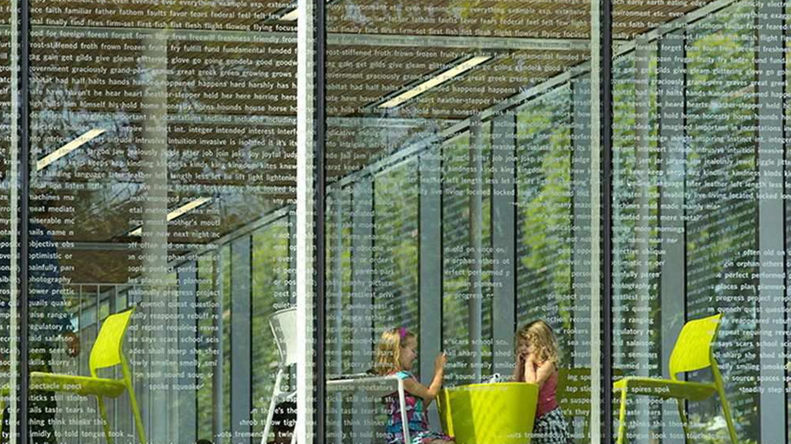
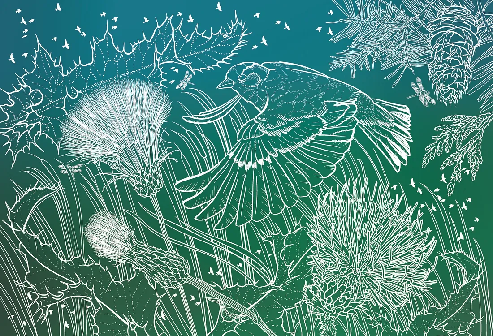
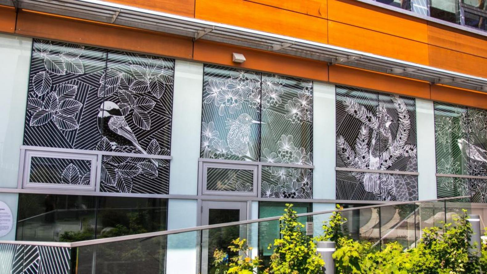

# Places to visit & Things to do

Thank you to _____ for compiling this section!

<!-- toc -->

---

## Places to visit

### Gardens
* Rose Garden (great to visit in the summer, June-July)
* Nitobe Memorial
* Botanical Gardens (+TreeWalk)
* IKB Learning Commons

### Beaches / Parks
* Wreck Beach
* Pacific Spirit Park
* Oasis Beach
* Spanish Banks
* Tower Beach

### Museums / Art Galleries
Note that you may have free access to these as a UBC student!

* Beaty Biodiversity
    - world's largest blue whale skeleton & two million captivating specimens
* Museum of Anthropology
    - 50,000 remarkable cultural artifacts and items
* Pacific Museum of Earth
    - Room of gemstones and interactive exhibits related to weather / the planet
* Belkin Art Gallery: contemporary art gallery
* AHVA Gallery: contemporary exhibition space for students & faculty
* Residential School History and Dialogue Centre
    - exhibit and interactive display to learn more about the legacy of residential schools in Canada

## Art on Campus

Art on campus tends to appear and disappear without warning, so visit them soon and let us know if somehting is out of date.

**Totem Poles**
    - [Reconciliation Pole](https://indigenous.ubc.ca/indigenous-engagement/featured-initiatives/reconciliation-pole/)

**Windows to prevent bird collision deaths**
See the CIRS building or other places like the UBC Bookstore

Articles:
    - https://sustain.ubc.ca/stories/bird-friendly-art-saves-feathered-lives
    - https://sustain.ubc.ca/stories/bird-friendly-windows-reduce-collision-deaths-ubc

|  |  |
|-|-|

| |
|-|

**Pride Installation**

Find it outside the AMS Nest

**Pressure Washer Art**

**Native Hosts Signs**
- https://planning.ubc.ca/news/6-pieces-public-art-21st-century 

## Miscellaneous
- Cherry Blossoms in the spring
- Leaves along main mall in the fall

## Events
- Storm the Wall
- Annual Snowball Fight
- Apple Festival?

## Relevant threads

- [Favourite city places get away from university?](https://old.reddit.com/r/UBC/comments/ek3p60/favourite_city_places_get_away_from_university/)

- [What are some fun things to do during the winter break?](https://old.reddit.com/r/UBC/comments/3wmlim/what_are_some_fun_things_to_do_during_the_winter/)
- [Things to do in UBC and area](https://old.reddit.com/r/UBC/comments/34r9cg/things_to_do_in_ubc_and_area/)
- [Pacific Regional Park - where to go in one hour?](https://old.reddit.com/r/UBC/comments/a203zz/pacific_regional_park_where_to_go_in_one_hour/)
